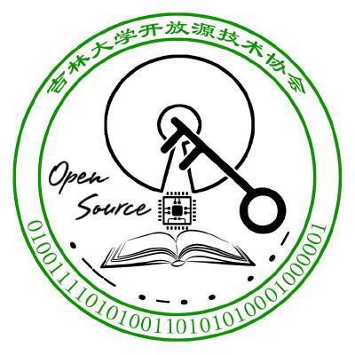



&emsp;&emsp;你可能在访问 jluosta.org 时进入了这个页面. 这不是意外. 该域名在 JLU OSTA (吉林大学开放源技术协会)的所有权已于 2025 年 10 月 28 日到期. 而我也不知道为什么这个域名当初会被订阅 8 年.  

&emsp;&emsp;今天查看邮件的垃圾箱时看到了该域名到期的提醒. 不论如何, 我(下文中的 Umaru-Xi)暂时回购了这个域名, 并将所有的HTTP/HTTPS 访问以状态码 301 重定向至本页面.  

&emsp;&emsp;下面这个徽记是所有成员集思广益的成果(原始文件已经丢失), 这里作为对大家齐心协力过的纪念.  

<!-- 
{:class="img-responsive"}   -->

&emsp;&emsp;下面是以该协会名义于 2024 年 05 月 10 日在 GitHub 以 README 的形式提交的最后一份公告的中文部分.  

> &emsp;&emsp;很遗憾, 我们, 吉林大学开放源技术协会, 早在 2018 年即终止. 我们坦诚自己的失败. 但你我共同志愿的荣光必不会黯淡, 我相信.  

> &emsp;&emsp;如果阁下期望寻找曾经与我们相关的人, 那么很抱歉地告知您: 在下也无法确切地奉告. 或许我们的前主导人之一 @liuweiky 依然活跃在 Github 平台, 阁下可以在本账号的 People 中找到. 在下是另一位前主导人, 但账号已经更换为 @Umaru-Xi, 阁下可以直接致信 umaru@umaru.science.  

> &emsp;&emsp;感谢阁下前来祭奠. 源必当永续!  

&emsp;&emsp;我能想起来的东西很少了, 只能补充一个该协会的组织结构. 学术部(决策与研究), 技术部(培训与技术支持), 运维部(好像是财务管理?), 外联部(好像是对外交流?), 秘书部(完全忘了是做什么的). 所以, 这样一个一开始就缺乏考虑和管理的社团会很快停止运营是可以预见的, 笑.  

&emsp;&emsp;随着记忆的丧失, 我应该也不会再维护 JLU OSTA 的相关信息了. 顺颂秋祺.  

&emsp;&emsp;

Yuki.N
  
